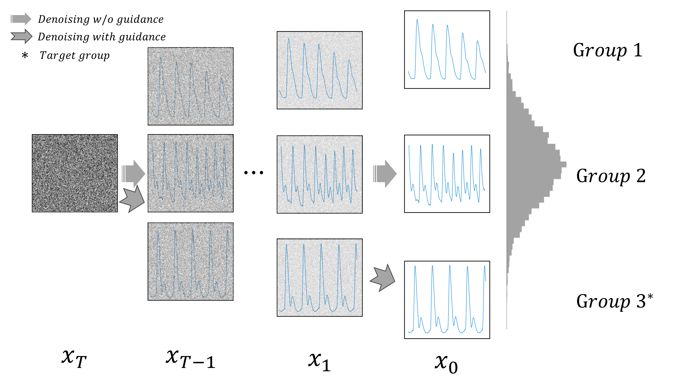

# Data Augmentation of PPG Signals Through Guided Diffusion

This repository contains PyTorch implemenations of Data Augmentation of PPG Signals Through Guided Diffusion by Python.

</img>

## Introduction
In this study, we tackle the challenge of data imbalance in medical datasets by generating high-quality, diverse Photoplethysmogram (PPG) signals using regressor-guided diffusion models. Our approach, a first in this field, effectively enhances Arterial Blood Pressure predictions from PPG data. We address signal noise issues through auxiliary class prediction and diffuse step scheduling, resulting in significant performance improvements in benchmark datasets.

### Project Tree
```
.
├── abp.py
├── data.py
├── denoising_diffusion_pytorch
│   ├── attend.py
│   ├── classifier_free_guidance.py
│   ├── cond_fn.py
│   ├── continuous_time_gaussian_diffusion.py
│   ├── denoising_diffusion_pytorch_1d_guided.py
│   ├── denoising_diffusion_pytorch_1d.py
│   ├── denoising_diffusion_pytorch.py
│   ├── elucidated_diffusion.py
│   ├── fid_evaluation.py
│   ├── guided_diffusion.py
│   ├── __init__.py
│   ├── learned_gaussian_diffusion.py
│   ├── model.py
│   ├── nn.py
│   ├── ppg_model.py
│   ├── resample.py
│   ├── resnet.py
│   ├── simple_diffusion.py
│   ├── version.py
│   ├── v_param_continuous_time_gaussian_diffusion.py
│   └── weighted_objective_gaussian_diffusion.py
├── main.py
├── models.py
├── paths.py
├── README.md
├── reg_resnet.py
├── setup.py
├── sh
│   ├── sample_diffusion.sh
│   ├── train_and_sample_diffusion_for_ppgbp.sh
│   ├── train_and_sample_diffusion_for_sensors.sh
│   └── train_reg_res.sh
└── utils.py
```

Our repository involves a three-step process:
1. **Training the guidance regressor**
2. **Training the diffusion model**
3. **Sampling target PPG signals** using the trained guidance regressor and diffusion model.

For this, we utilize `reg_resnet.py` and `main.py`. `reg_resnet.py` is for training the guidance regressor, and `main.py` manages both the training and sampling of the diffusion model. If the diffusion model has already been trained, you can use the `--sample_only` flag in `main.py` to skip the training phase and proceed directly to sampling.

Also, for hyperparameter sweeping, we used files located in ```./sh ```.

## Implementation

We used the following Python packages for core development. We tested on `Python 3.10.10`.
```
pytorch                   2.0.0
pandas                    2.0.0
numpy                     1.23.5
scikit-learn              1.2.2
scipy                     1.10.1
```

### Arg Parser

The script `main.py` allows to train and evaluate all the baselines we consider.

To train proposed methods use this:
```
main.py --epochs=<EPOCHS>                      \
        --model=<MODEL>                        \
        --num_features=<NUM_FEATURES>          \
        --hidden_dim=<HIDEN_DIM>               \
        --num_layers=<NUM_LAYERS>              \
        --num_heads=<NUM_HEADS>                \
        [--disable_embedding]                  \
        --wd=<WD>                              \
        --lr_init=<LR_INIT>                    \
        --drop_out=<DROP_OUT>                  \
        --lamb=<LAMB>                          \
        --scheduler=<SCHEDULAR>                \
        --t_max=<T_MAX>                        \
        [--ignore_wandb]
```
Parameters:
* ```EPOCHS``` &mdash; number of training epochs (default: 300)
* ```MODEL``` &mdash; model name (default: transformer) :
    - transformer
    - linear
    - ridge
    - mlp
    - svr
    - rfr
* ```NUM_FEATURES``` &mdash; feature size (default : 128)
* ```HIDEN_DIM``` &mdash; DL model hidden size (default : 64)
* ```NUM_LAYERS``` &mdash; DL model layer num (default : 3)
* ```NUM_HEADS``` &mdash; Transformer model head num (default : 2)
* ```--disable_embedding``` &mdash; Disable embedding to use raw data 
* ```WD``` &mdash; weight decay (default: 5e-4)
* ```LR_INIT``` &mdash; initial learning rate (default: 0.005)
* ```DROP_OUT``` &mdash; dropout rate (default: 0.0)
* ```LAMB``` &mdash; Penalty term for Ridge Regression (Default : 0)
* ```scheduler``` &mdash; schedular (default: constant) :
    - constant
    - cos_anneal
* ```t_max``` &mdash; T_max for Cosine Annealing Learning Rate Scheduler (Default : 300)
* ```--ignore_wandb``` &mdash; Ignore WandB to do not save results

----

### Train Models

To train model for example, use this:

```
# linear
python3 main.py --model=linear --optim=adam --lr_init=1e-4 --wd=1e-3 --epochs=200 --scheduler=cos_anneal --t_max=200 

# mlp
python3 main.py --model=mlp --hidden_dim=128 --optim=adam --lr_init=1e-4 --wd=1e-3 --epochs=200 --scheduler=cos_anneal --t_max=200 --drop_out=0.1 --num_layers=3

# transformer
python3 main.py --model=transformer --hidden_dim=128 --optim=adam --lr_init=1e-4 --wd=1e-3 --epochs=200 --scheduler=cos_anneal --t_max=200 --drop_out=0.1 --num_layers=2 --num_heads=2

```

If you want to sweep model to search best hyperparameter, you can use this:

```
# linear
bash sh/linear.sh

# mlp
bash sh/mlp.sh 

# transformer
bash sh/transformer.sh

```

It should be modified for appropriate parameters for personal sweeping

### Evaluate Models

To test model, use this:
```
# linear
python3 main.py --model=linear --hidden_dim=128 --eval_model=<MODEL_PATH>

# mlp
python3 main.py --model=mlp --hidden_dim=128 --num_layers=3 --eval_model=<MODEL_PATH>

# transformer
python3 main.py --model=transformer --hidden_dim=128 --num_layers=2 --num_heads=2 --eval_model=<MODEL_PATH>
```

